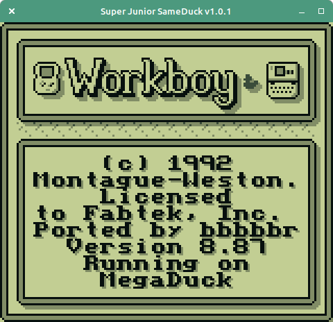

## Duck Duck Workboy
The fabled Workboy ROM patched to run on the Mega Duck Laptop.

The Mega Duck laptop is a Game Boy clone with minor changes to make it incompatible and a built-in keyboard and RTC.

### Project 
This is a partial disassembly and rom patch of the fabled Game Boy Workboy accessory to the MegaDuck Super Quique / Super Junior Computer clone console.

Features/Changes:
- RTC and Keyboard are patched and translated to use the Mega Duck laptop versions
- Support for MD2 and MBC5 cartridge memory bank controllers (mbcs)
- Slightly modified Title Screen
- Removed Italian language support to make room for Mega Duck code

What doesn't work / glitches:
- Clock time elapses too slowly. (1)
- Visual glitches in screen highlighting/inverting. (2)

### Download and Patching
The patches **do not** include the ROM, you must have your own copy of the Workboy ROM to apply this modification.

`Workboy` checksums
- MD5: `9cbd5ff8ff720dfdf4580338626d353b`
- SHA-1: `5b20683d09bc3bb57dfdd0ea8b9fa5eda620014f`

The patch is available on itch io at
https://bbbbbr.itch.io/mega-duck-patch-for-workboy-game-boy.

The patch is in UPS format. It can be applied using this online patcher (or any other patcher that supports UPS patches) at: https://www.romhacking.net/patch/

### Keyboard Setup

#### On Physical Duck Laptop Hardware
* Mega Duck -> Shift: Selects between Mega Duck regular keys vs alternates (printed on keyboard)
* Mega Duck -> Caps Lock: Selects between Workboy regular keys vs alternates (printed on keyboard). When pressed down it emulates a Workboy `NUM` button press, and when released it emulates the a `CAPS` button press.

#### In the Super Junior Same Duck Emulator
(TODO)

### Thanks, References, Tools
- [Same Boy](https://github.com/LIJI32/SameBoy) / LIJI32 : Same Boy emu and Workboy reference
  - [Super Junior Same Duck](https://github.com/bbbbbr/SuperJuniorSameDuck): My fork of Same Boy with Mega Duck laptop emulation
- Liam Robertson's [research and documentary](https://www.youtube.com/watch?v=SZcrPM-jDqY)
- [Emulicious](https://emulicious.net): Game Boy emulator with a very useful debugger and disassembler
- [RGBDS](https://rgbds.gbdev.io) assembler
- [UPS Patch](https://github.com/rameshvarun/ups) for generating patch output

### Building
Prereq: rgbds 0.6.0 (in the system path)

`make` to build the various patches

### Notes

1. Clock time is ticked in the VBlank interrupt handler. That handler is prone to switching the ROM bank without saving and restoring the bank to what it was before the interrupt. Since ROM 0 has little free space the Mega Duck keyboard and RTC IO code has been placed in banked ROM. Which means if the VBlank handler triggers when some other (banked) code is polling the keyboard (and thus switched the ROM bank for Mega Duck IO), then when the VBlank handler exits the ROM bank may be wrong, resulting in a crash. The workaround is to disable the VBlank handler when polling Mega Duck IO, and the side effect of that is the clock time in VBlank may have skipped ticks.

2. The workboy ROM uses screen inverting to highlight some elements on screen. The STAT LYC interrupt is used for handling some of this, as well as a reset per frame in the VBLank handler. Similar to (1) the blocking of the VBlank handler while executing some banked Mega Duck code interferes with this and causes some flickering.
