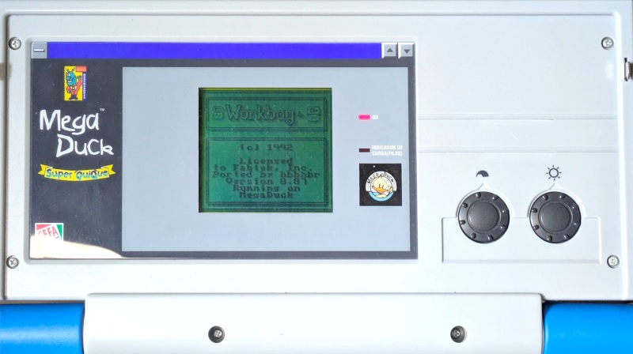

## Duck Duck Workboy
The fabled Workboy ROM patched to run on the Mega Duck Laptop.

The Mega Duck is a Game Boy clone with minor changes to make it incompatible with Game Boy ROMs. The laptop model has a built-in keyboard and RTC connected via the link port (similar to the unreleased Workboy), making it suitable alternative hardware to run on.

### Project 
This is a partial disassembly and rom patch of the fabled Game Boy Workboy accessory to the MegaDuck Super Quique / Super Junior Computer clone console.

Features/Changes:
- RTC and Keyboard are patched and translated to use the Mega Duck laptop versions
- Support for MD2 and MBC5 cartridge memory bank controllers (mbcs)
- Slightly modified Title Screen
- Removed Italian language support to make room for Mega Duck code

What doesn't work / glitches:
- TBD

### Download and Patching
The patches **do not** include the ROM, you must have your own copy of the Workboy ROM to apply this modification.

`Workboy` checksums
- MD5: `9cbd5ff8ff720dfdf4580338626d353b`
- SHA-1: `5b20683d09bc3bb57dfdd0ea8b9fa5eda620014f`

The patch is available on itch io at
https://bbbbbr.itch.io/mega-duck-patch-for-workboy-game-boy.

The patch is in UPS format. It can be applied using this online patcher (or any other patcher that supports UPS patches) at: https://www.romhacking.net/patch/

### Running the Program

#### On Physical Duck Laptop Hardware
There are a few options for running the patched ROM on the duck laptop.
- A MegaDuck Flash Cart with "MD2" + SRAM banking support (16K banks switchable writing to 0x0001) such as the picoDuck by zwenergy (Use MD2 patch) (TODO: link to picoDuck firmware)
- On a Game Boy MBC5 Flash Cart using a [MegaDuck Cart Slot Adapter](https://github.com/bbbbbr/gb_to_megaduck_cart_adapter/tree/main). (Use MBC5 patch)

#### In the Super Junior Same Duck Emulator
The [Super Junior Same Duck](https://github.com/bbbbbr/SuperJuniorSameDuck) emulator can also be used to run the ROM. It supports both MD2 and MBC5 builds. For the MD2 build make sure to use the `--duck-sram-cart` flag to tell the emulator it should enable the SRAM cart in the secondary memory cart slot.
- `superjunior_sameduck --force-mbc 0x1B workboy.mbc5`
- `superjunior_sameduck --duck-sram-cart workboy.md2`

### Keyboard Setup

#### On Physical Duck Laptop Hardware
- Mega Duck -> Shift: Selects between Mega Duck regular keys vs alternates (printed on keyboard)
- Mega Duck -> Caps Lock: Selects between Workboy regular keys vs alternates (printed on keyboard). When pressed down it emulates a Workboy `NUM` button press, and when released it emulates the a `CAPS` button press.
- For some keys on the Mega Duck (such as 0-9, num pad, etc) a simulated shift is automatically sent to the ROM to make using them easier and more seamless.

#### In the Super Junior Same Duck Emulator
Running the patched ROM in an emulator means there's two layers of keyboard translation at play, which makes using it a little more convoluted in some cases.

PC -> Emulating Mega Duck Keyboard -> Mega Duck -> Emulating Workboy Keyboard -> Patched ROM

TODO: details/tips

### Thanks, References, Tools
- [Same Boy](https://github.com/LIJI32/SameBoy) / LIJI32 : Same Boy emu and Workboy reference
  - [Super Junior Same Duck](https://github.com/bbbbbr/SuperJuniorSameDuck): My fork of Same Boy with Mega Duck laptop emulation
- Liam Robertson's [research and documentary](https://www.youtube.com/watch?v=SZcrPM-jDqY)
- [Emulicious](https://emulicious.net): Game Boy emulator with a very useful debugger and disassembler
- [RGBDS](https://rgbds.gbdev.io) assembler
- [UPS Patch](https://github.com/rameshvarun/ups) for generating patch output

### Building
Prereq: rgbds 0.6.0 (in the system path)

`make` to build the various patches

